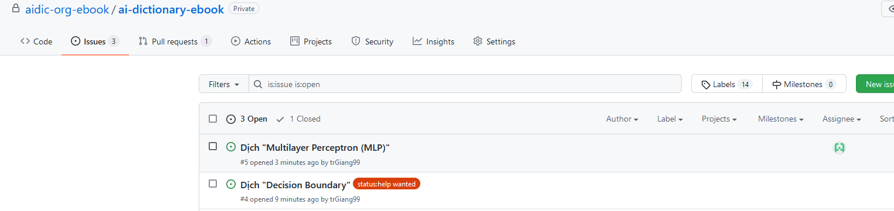
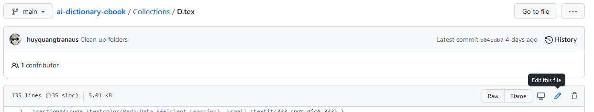
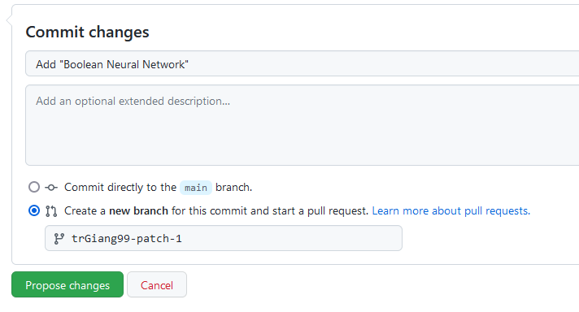
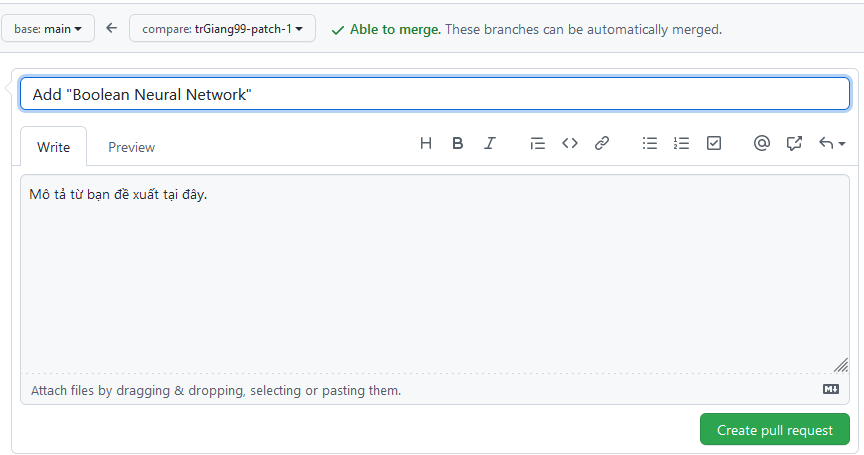
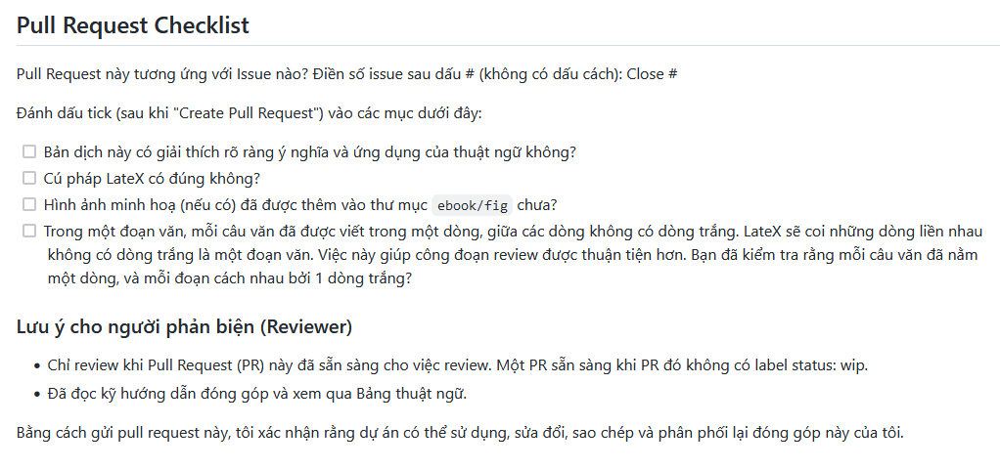
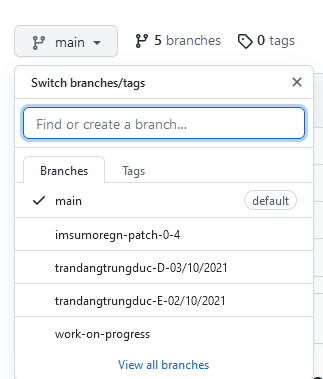
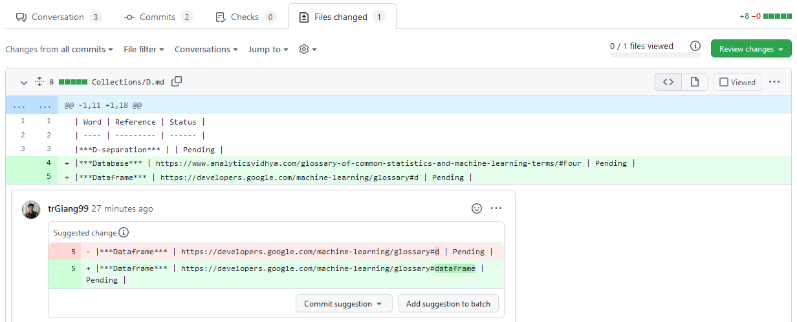
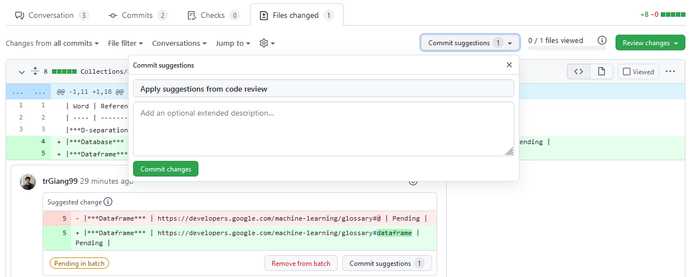

# Hướng dẫn dành cho người đóng góp

Dưới đây là hướng dẫn những việc cần làm khi tham gia quá trình dịch thuật một cách cơ bản nhất.

## Bước 1: Tìm và đăng ký phần cần dịch
Bạn cần tìm đến **[tab Issue](https://github.com/aidic-org-ebook/ai-dictionary-ebook/issues)**, những Issue chưa có người nhận dịch được đánh dấu bằng nhãn `status:help wanted`. Trước khi thực hiện việc dịch thuật phần nội dung được chỉ định trong Issue, bạn cần để lại comment vào trong issue đó và cc @trGiang99 (khuyến khích) hoặc @huyquangtranaus để chúng tôi assign Issue này cho bạn.


> Khi bạn được assign thì bạn sẽ thấy avatar của mình nằm bên phải của issue, ở issue đầu tiên đang còn nhãn `status:help wanted` thì đây là issue mà bạn có thể comment để nhận dịch.

**Lưu ý:** Bạn chỉ nên bắt đầu việc dịch thuật khi bạn đã được assign vào Issue mà mình đã nhận. Để đảm bảo tiến độ dự án, chúng tôi khuyến khích khoảng thời gian từ lúc bạn được assign 1 Issue cho đến lúc bạn tạo PR để hoàn thành Issue đó tối đa là 5 ngày.

## Bước 2: Xem qua phần nội dung cần dịch
Mỗi Issue đều để một đường dẫn đến phần nội dung bạn cần dịch cùng với hướng dẫn cách bạn có thể tương tác với tập tin, bạn hãy xem qua để nắm rõ giới hạn nội dung.

Sau khi vào tập tin tương ứng, bạn nhấn vào nút "Edit" hình chiếc bút chì để bắt đầu tìm và dịch phần đã nhận.



## Bước 3: Tiến hành dịch thuật
Để bắt đầu dịch thuật, bạn tìm đến phần các dòng như:
```LateX
\section*{\huge \textcolor{Red}{Decision Boundary}  \small \textit{??? chưa dịch ???} }
Tham khảo\footnote{https://developers.google.com/machine-learning/glossary\#decision-boundary} (tạm để đây, còn khi dịch sau sẽ xoá hoặc giấu dòng này đi)
\subsection*{Định nghĩa:}
???
\subsection*{Ví dụ:}
???
\subsection*{Mẹo nhỏ:}
???
```
Hãy chỉnh sửa phần nội dung này. Một số phần nếu không cần thiết (như Phần Ví dụ), bạn có thể để trạng thái comment bằng cách thêm dấu `%` vào đầu dòng.

**Một vài lưu ý khi dịch thuật:**
- Đảm bảo đúng chính tả, tránh các cụm từ viết tắt nếu có thể.
- Phần định nghĩa từ toàn bộ nên là Tiếng Việt (trừ danh từ riêng).
- Các thuật ngữ cần được dịch một cách nhất quán trong suốt từ điển. Nếu một thuật ngữ chưa có trong bảng thuật ngữ, bạn có thể đề xuất vào Giai đoạn 1 của dự án bằng cách tạo một PR mới trong repo `word-collections` và trình bày quan điểm.
- Nếu có 1 thuật ngữ nào đó trong phần định nghĩa chưa được dịch chính thức trong Tiếng Việt, nên viết từ Tiếng Việt kèm theo Tiếng Anh trong dấu ngoặc đơn (như `vùng của từng cụm (cluster) dữ liệu`).

**Lưu ý về format nội dung:**
- Đảm bảo đúng cú pháp LateX.
- Trong một đoạn nội dung, mỗi câu dịch nên để riêng một dòng để thuận tiện cho quá trình Review ở Bước 4 (do LateX coi cách 1 dòng là ngắt đoạn, 2 dòng sát nhau vẫn trong cùng 1 đoạn).
- Hình ảnh (nếu có) không nên sử dụng hình ảnh có bản quyền, các hình ảnh mờ hay không rõ nghĩa; nếu có thể, nên vẽ lại cho phù hợp. Các văn bản trong hình ảnh minh hoạ nên là Tiếng Việt.
- Không tự ý thêm bớt các dòng trắng.

## Bước 4: Mở Pull Request (PR)

Sau khi hoàn thiện việc thêm từ bạn muốn đề xuất, bạn cần kéo xuống cuối trang để tiến hành đưa nội dung này lên Repo. Trước tiên, bạn cần đặt tên cho commit này theo cú pháp *Add <từ bạn đề xuất>*, và chọn "*Create a new branch for this commit and start a pull request*". Cuối cùng, bạn hãy nhấn vào **Propose changes**.



Sau khi bạn đã chọn commit, trang tạo Pull request sẽ tự động mở ra. Chọn **Create pull request**.



Bạn hãy kiểm tra qua nội dung một lần nữa xem Pull request của mình đã thoả mãn các đầu mục mà checklist đưa ra hay chưa. Nếu chưa, bạn hãy cập nhật; nếu rồi, bạn hãy chọn vào những ô tương ứng đã hoàn thành như hình dưới đây.



**Chú ý**: Nếu trong bản dịch của bạn có hình minh hoạ, trước tiên, hãy thêm đường dẫn tới hình của bạn theo cú pháp sau:

```LateX
\begin{figure}[!h]
    \centering
    \includegraphics[width=1.0\linewidth]{figures/Attention Mechanism.png}
    \caption{Caption (optional}
    \label{fig:attention_mechanism}
\end{figure}
```
Bạn hãy tiếp tục tiến hành tạo PR như hướng dẫn ở trên, rồi sau đó truy cập vào nhánh bạn mới tạo tại [trang chủ kho chứa](https://github.com/aidic-org-ebook/ai-dictionary-ebook) như hình minh hoạ.



Sau đó, hãy truy cập vào thư mục `ebook/fiures`, chọn Add files $\rightarrow$ Upload files để upload ảnh, và tiến hành Commit thay đổi của bạn tại cùng branch mà bạn đề xuất bản dịch.


## Bước 5: Duyệt và đưa thuật ngữ vào danh sách từ

Sau khi bạn tạo PR, các thành viên trong nhóm `advisors` sẽ tiến hành duyệt, và phản biện nếu cần thiết.

Khi bạn nhận được phản hồi từ reviewer, bạn nên vào tab **Files changed** để xem toàn bộ các gợi ý chỉnh sửa.



Sau đấy, ở mỗi phần gợi ý, bạn cần cân nhắc liệu bạn có đồng tình với gợi ý đó hay không. Nếu có thì bạn hãy nhấn **Add suggestion to batch**, nếu không thì bạn comment vào để thảo luận với reviewer nhằm tìm ra giải pháp phù hợp cuối cùng.



Sau khi hoàn tất việc kiểm tra, phản hồi thì bạn chọn ở nút **Commit suggestion** theo hình và nhấn **Commit changes** để cập nhật những thay đổi. Với các bước như vậy, bạn không phải cập nhật thủ công những phần gợi ý của reviewer, và những người phản biện khác cũng sẽ biết bạn đang cập nhật theo reviewer nào hay nội dung đó bạn tự thay đổi theo ý bạn.

Khi có 2 thành viên `advisors` đồng ý với đề xuất của bạn, bản dịch của bạn sẽ được **merge** vào kho chứa.

Xin cảm ơn bạn đã tham gia hỗ trợ cho nhóm trong giai đoạn này.