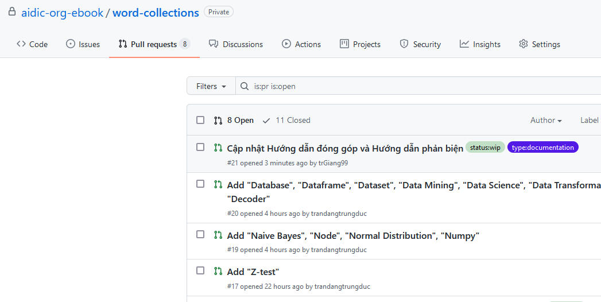
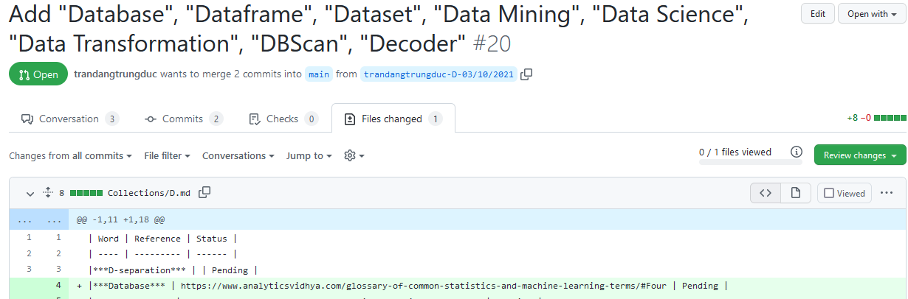
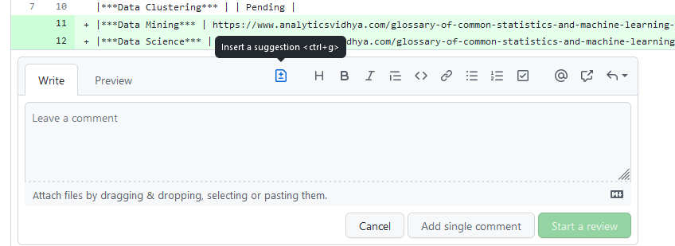
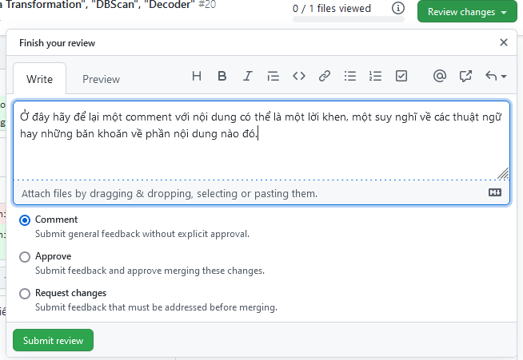

# Hướng dẫn dành cho người phản biện

Đầu tiên, bạn truy cập vào tab **[Pull request](https://github.com/aidic-org-ebook/word-collections/pulls)**, chọn một PR và kiểm tra xem nội dung này đã sẵn sàng để review hay chưa.

> Ở hình này, bản nháp của PR thì sẽ được gán nhãn `status:wip` (Work in progress).

Nếu PR đã sẵn sàng review, bạn hãy truy cập vào tab `File changed` để xem toàn bộ nội dung.

Nếu bạn muốn chỉnh sửa 1 dòng nội dung, hãy nhấn vào dấu cộng khi hover chuột tại dòng đó. Sau đó, bạn hãy sử dụng tính năng **Insert a suggestion** để gợi ý chỉnh sửa. Sau gợi ý đó, nhấn chọn **Start a review**.

*Chú ý*: Chúng tôi không khuyến khích sử dụng tính năng **A single comment** nếu như bạn có trên 2 gợi ý dành cho PR đó.

Sau khi bạn đã review qua hết lượt nội dung từng dòng một, hãy chọn **Review changes** và làm theo hướng dẫn trong hình phía dưới.

